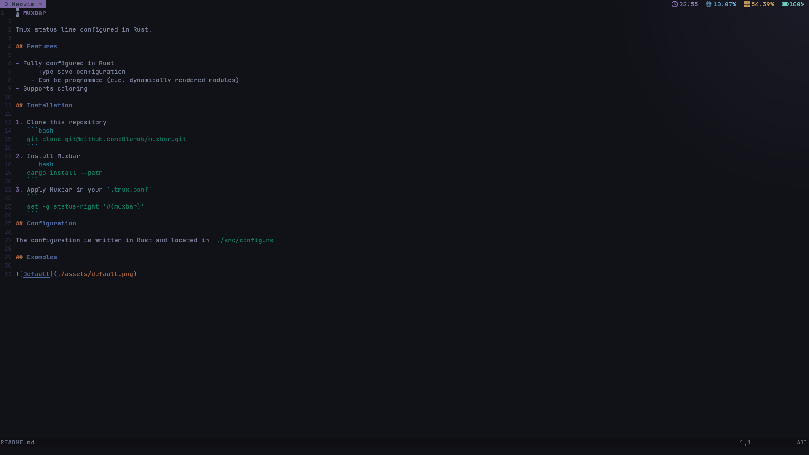

# Muxbar

Tmux status line configured in Rust.

## Features

- Fully configured in Rust
  - Type-save configuration
  - Can be programmed (e.g. dynamically rendered modules)
- Supports formatting
- Modules are evaluated parallel

## Installation

1. Clone this repository

   ```bash
   git clone git@github.com:Dlurak/muxbar.git
   ```

2. Install Muxbar

   ```bash
   cargo install --path .
   ```

3. Apply Muxbar in your `.tmux.conf`

   ```text
   set -g status-right '#(muxbar)'
   ```

## Configuration

The configuration is written in Rust and located in `./src/config.rs`

## Examples



